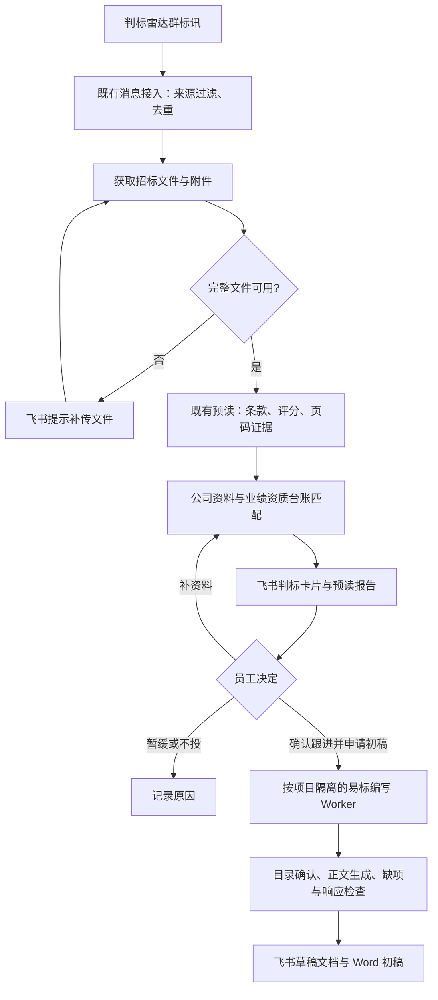

# 易标与飞书联动实施方案

日期：2026-09-09

状态：方案待评审；源码已落地，客户端构建与原生数据库验证通过，已实际启动首页。本文描述目标行为，不代表飞书联动功能已经上线。

## 目标与使用方式

公司人员在飞书内完成标讯筛选、预读、投标决策和标书初稿申请，不需要登录易标或妙搭。系统运行在常开主机；易标桌面端保留给管理员和编写人员做精细编辑。

推荐流程：

“免登录平台”指在已经登录的飞书中操作，不开放匿名访问公司资料。

## 已核实的复用基础

- 易标源码基线为仓库 `lhsl2026/OpenBidKit_Yibiao` 的 `main` 快照，归档前缀为 `33eedc9`。
- 有效客户端在 `client/`，Electron Main 通过服务和 SQLite 保存业务状态，Renderer 通过 IPC 操作。
- `technicalPlanStore.cjs` 的技术方案使用单个当前工作区；`taskService.cjs` 的同组任务互斥，不能直接当作多项目并行服务。
- README 提到开放 API，但本轮检索未发现对外提供标书分析、生成、导出能力的业务 HTTP 服务；Agent 模型代理的 HTTP server 不等同于业务 API。
- 既有预读系统已实现雷达日报解析、文件获取、页码证据、人工复核、响应矩阵、飞书原位卡片更新与版本化 handoff。
- 自建共享平台已有飞书网关、BullMQ、PostgreSQL、对象存储和原生飞书投递代码。历史迁移记录仍有模型接入、知识库授权和真实测试群验收事项；不能据历史的容器启动记录断言当前可用。
- 用户已指定使用之前的公司资料和业绩资质台账。本轮已核对本地 BidVault 的真实库结构；该库具有业绩、证照和附件记录，但没有公司主体 ID 或逐项人工核验标记。

## 方案选择

| 方案 | 优点 | 代价 | 结论 |
| --- | --- | --- | --- |
| 复用飞书预读和共享服务，易标作为独立编写引擎 | 继承既有条款、证据、断点和卡片能力；员工留在飞书 | 增加易标任务适配层与项目隔离 | 推荐 |
| 将所有飞书能力直接塞进桌面易标 | 初期演示直接 | 依赖客户端在线；单工作区冲突；重复实现预读状态机 | 不作为公司生产主路径 |
| 全部重写为 Web 平台 | 可以统一服务端模型 | 范围最大，重复建设现有能力，延迟业务使用 | 暂不采用 |

## 自动预读与消息接入

优先继承现有接收路径。只处理判标雷达来源群和指定发布机器人的标讯，忽略普通聊天及本系统自己的输出；不得仅靠文字群名识别来源。

机器人是否能收到另一个机器人的消息必须真实验证，不能假设把机器人拉进群就足够。既有用户身份监听或标讯生产端的结构化接口可以作为接入基础；变更事件消费者前检查是否会抢占已有消费者。

自动触发使用消息到达事件。每日摘要汇总新增标讯、已预读、待补件、待决策、临近截止五类状态；补偿任务使用持久游标和时间窗，遵循同一去重规则。生产系统内部调度，不依赖某次 Codex 对话持续运行。

去重分两层：来源消息 ID 防重复接收；项目编号、标段和源文件哈希防重复预读。更正公告或文件哈希变化产生新版本，旧卡片显示已被替代并重新核查受影响项。

只有公告、下载需要登录或文件不可获取时，明确标为“公告初筛／待补完整文件”。不能声称已完成完整预读。扫描页与缺页沿用人工复核；需要时补上 OCR 接口，但 OCR 输出也必须保留页码和复核状态。

## 判标卡片

卡片首先回答三个问题：投标判断、关键阻塞、拿分与动作。

展示字段：项目与标段、预算／最高限价、投标截止时间、评标方法、硬性门槛、公司匹配证据、废标风险、评分重点、资料缺口和负责人。每个关键结论关联招标条款和 PDF 物理页码，支持查看飞书报告及招标源文件。

结论分为：

- **建议跟进**：已核查的硬门槛均满足，关键资料完整；这是辅助建议，仍由员工决定是否投标。
- **暂缓，待核实**：缺文件、缺公司主体归属、未核实资料、证照有效期未知、材料缺失或关键条件歧义。
- **不建议投标**：有明确证据表明硬性条件不满足，或截止日期已过；标出具体依据。

没有匹配到台账记录只能说明“尚未找到证据”，不能自动等同于公司没有资格。没有完整评分和竞争信息时不输出虚假的中标概率；最低评标价法不套用技术／商务／价格百分制。

操作：确认跟进、暂缓、不投并记录原因、补传资料、生成初稿。长任务立即回执并后台执行；通过同一项目卡片更新进度，避免重复刷屏。卡片回调校验操作者、允许的群、项目和文档版本，重复点击返回原任务。

## 公司资料与业绩资质台账

第一期以只读快照对接现有 BidVault 和公司权威资料。禁止多个后台进程直接写本地 SQLite，禁止将桌面数据库作为多人网络共享数据库。

匹配快照至少记录来源记录 ID、更新时间、附件哈希、公司主体归属、资料校验状态和适用范围。现有库缺少的公司主体及校验字段由独立映射表补充，不改写原台账。主体未确认时不能把不同公司的业绩或证照拼成一家公司的能力。

资格有效性按投标截止日判断，不只按当天判断。缺日期、已过期、缺扫描件、损坏或不可读附件都进入待核实；合同金额、签订／验收时间、项目类型与证明材料分别核对。文件名与 AI 推断只用作候选检索，不能替代原件证明。

群卡只展示决策所需摘要。完整证书、人员身份数据和合同原件保留在受控资料入口；模型只获取当前项目必要材料，不整库上传。

## 易标编写适配层

输入使用既有预读 handoff：`schemaVersion`、任务 ID、报告及文件版本、checksum、requirements、evidence、warnings、status。仅接收未被替代、人工阻塞已解除并且已确认跟进的快照。

按 `projectId + documentVersion` 创建独立 Worker 工作目录，设置独立 Electron userData；一期单并发运行，队列等待。不得让多个标讯复用当前桌面 `technical-plan/tender.md` 和 `yibiao.sqlite`。

Worker 复用现有 `fileService`、`technicalPlanStore`、`taskService`、`aiService` 和 `exportService`；新增的任务命令只做鉴权、边界校验、任务入队与结果交接。队列接口限定私网／本机，不能将 Electron IPC 任意暴露到公网。

生成流程：确认项目和标段 → 导入招标文件与预读结构化证据 → 拟定目录 → 飞书确认目录／必要事实 → 逐章生成 → 响应矩阵与缺项检查 → 飞书文档和 Word 初稿。

必须将公司联动任务的 `globalFactsMode` 固定为 `placeholder`。上游当前默认为 `fabricate`，页面明确描述可杜撰未提供的人名等事实，这不适合正式投标流程。未知人员、证书、业绩、参数和承诺保留“待填写”，不自动补造；关键材料缺失时不得把初稿标为可正式提交。

任务持久化状态：queued、running、waiting_confirmation、needs_material、completed、failed、cancelled。记录断点、版本、输出文件哈希和飞书消息／文档绑定。重启续跑和重复请求不得重复生成或重复投递。

不自动填写最终报价，不自动签章，不自动向交易平台提交投标文件。

## 部署与验收顺序

1. 本机安装并验证易标：`npm ci`、`npm run build`、Electron native smoke；需要 Open XML 调试或打包时补齐 .NET 10 SDK。
2. 核对现有自建服务、模型配置和知识库权限，以真实探针验收，避免另建重复网关和事件监听器。
3. 完成只读台账快照、公司主体映射与判标卡片；用脱敏样本验证“缺证据不当作已满足”。
4. 测试群贯通标讯接收、补传、预读、匹配、卡片投递和重复消息处理。
5. 接入易标独立 Worker，测试两项目隔离、目录确认、缺项占位、取消／重启恢复及 Word／飞书交付。
6. 用至少一份综合评分法、一份最低评标价法、一份缺附件／扫描件的真实授权样本做业务验收；检查多标段、更正公告、重复事件、模型失败与发送失败。
7. 验收后切换公司使用群，保留旧预读回退入口和数据，不并行启动会重复处理同一事件的消费者。

## 外部条件与当前缺口

- 明确且可持续在线的宿主机。开发电脑关机后，本地 Worker 无法继续工作；需要公司常开主机承载。
- 可用模型端点与额度，现有迁移任务仍有模型接入未完成记录。
- 飞书测试投递群、应用权限、Wiki／文档访问权限，优先复用现有配置并实际核验。
- 公司主体及权威资料映射，不能从台账名称或文件名推断。

密钥通过部署环境安全配置，不放入本文或 Git。真实群 ID、公司材料正文、人员身份信息和数据库文件不进入仓库。
