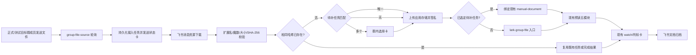

# 正式飞书群招标文件自动接入设计

**日期：** 2026-09-16

**状态：** 待书面规格复核

**适用系统：** OpenBidKit 飞书联动、现有预读计算底座

**公司主体：** 隆创信息有限公司

## 背景与根因

“隆创投标决策群”成员发送 PDF 招标文件后，机器人没有回应。现有 `radar-source.cjs` 只轮询判标雷达来源群，只允许配置过的机器人发送者，并且只接收文本消息。正式决策群、普通成员和 `file` 消息都被排除。因此文件虽然仍在飞书群历史中，却没有进入 OpenBidKit，也没有触发预读、判标卡或报告归档。

当前预读后端已经提供正式文件入口：

```text
POST /openapi/preread/events/lark-group-file
```

该入口接受群、消息、发送者和带签名 URL 的文件候选，能够创建预读任务并启动现有五模块流程。OpenBidKit 也已有飞书历史读取、消息资源下载、妙搭应用存储上传与签名、任务 watch、判标卡和飞书文档归档能力。本次应补齐文件接入层，不复制预读、判标或归档实现。

## 目标

1. 正式或测试目标群中的普通成员发送 PDF、DOC、DOCX 后，系统自动接收。
2. 文件被发现后立即在同一群发送“已收到、正在识别”状态卡，并持续原位更新。
3. 下载后计算 SHA-256；相同文件不重复创建任务，不重复调用模型。
4. 文件能唯一匹配现有待补招标文件任务时，绑定该任务；无法匹配时创建新预读任务；多个候选时暂停并让成员选择。
5. 预读完成后复用现有一眼判标卡和飞书文档归档，不要求成员登录平台。
6. 任一失败都显示明确阶段、稳定错误码和可执行建议，同时不暴露内部路径、异常、凭证或私人标识。
7. 部署后通过同一入口重放群内刚发送的文件，成员无需重新上传。

## 非目标

- 不自动作出“确定可投”结论；公司证据不足时继续显示“待核实”。
- 不自动报价、签章、提交投标或混用其他公司资料。
- 第一版不接收压缩包、图片、音视频或群外私聊文件。
- 不恢复已经退役的旧飞书监听层；旧预读计算底座继续作为后端运行。
- 不改变商务标或技术标生成流程。

## 方案比较与选择

### 方案一：恢复旧预读监听器

优点是旧代码已经处理过文件。缺点是它与当前 OpenBidKit 同时监听后会形成双入口、双状态和重复调用风险，且违背已经确认的“关掉旧飞书监听层”决策。

### 方案二：把文件塞进现有雷达文本入口

改动表面较小，但雷达入口的来源白名单、文本规范化、编辑失效和项目选择语义都针对机器人标讯。继续扩展会把两种安全边界混在一起，难以正确处理普通成员、文件哈希和待补任务绑定。

### 方案三：新增正式群文件源，复用下游能力

新增独立 `group-file-source` 和持久状态机，只负责发现、校验、下载、去重、匹配和提交。提交后继续使用现有预读、任务 watch、判标卡和报告归档。本方案边界清楚，便于独立测试和故障恢复，选用此方案。

## 总体架构



### 组件边界

新增 `integrations/feishu/group-file-source.cjs`，职责仅包括：

- 轮询当前激活的正式或测试目标群；
- 只接收未删除、发送者为普通用户、消息类型为 `file` 的消息；
- 解析文件名和 `file_key`；
- 建立持久接入任务并驱动状态机；
- 调用下载、存储、任务匹配和预读客户端；
- 请求状态卡创建或更新。

扩展 `preread.cjs`：

- `receiveGroupFile(body)` 调用 `/openapi/preread/events/lark-group-file`；
- `attachManualDocument(taskId, body)` 复用现有待补文件接口；
- 两个调用均使用现有 Relay Bearer 鉴权和超时边界。

扩展 `runner.cjs`：

- 在同一 runner 租约下轮询并推进文件任务；
- 收到预读回执后调用现有 `recordReceipt()` 注册 watch；
- 不另建第二个预读结果消费者。

扩展 `lark.cjs` 和 `store.cjs`：

- 保存一个稳定的状态卡消息流，首次创建使用固定 UUID，后续只更新原消息；
- 保存文件接入任务、哈希去重索引、重试时间和错误码；
- 进程重启后从最后一个已确认阶段恢复。

## 消息发现与输入校验

文件源沿用雷达轮询的固定时间窗和分页方法，但使用独立游标。每次外部读取前先持久化当前时间窗和分页 token，完成整页处理后才推进游标，避免进程中断造成跳页。

接收条件同时满足：

- `chat_id` 等于当前模式的唯一目标群，且在对应允许群列表中；
- 消息未删除，类型为 `file`；
- 发送者类型为普通用户；
- 消息 ID、创建时间、文件名、`file_key` 格式有效；
- 扩展名为 `.pdf`、`.doc` 或 `.docx`，不区分大小写；
- 消息创建时间不早于配置的启用时间，显式重放除外。

系统只使用飞书返回的消息 ID 和 `file_key` 下载资源，不接受群消息中的任意本地路径或外部 URL。文件名先去除路径信息和控制字符，只用于展示及安全的临时文件后缀。

## 文件下载、校验与受控存储

历史读取和资源下载使用独立的已授权用户 CLI profile，因为生产环境中机器人身份不能可靠读取该群历史。命令通过 `execFile` 参数数组调用，不拼接 shell 字符串。

下载写入 `BID_DATA_ROOT/group-files/tmp/<job-id>/`，完成后检查：

- 实际文件为普通文件，真实路径仍在受控目录内；
- 大小大于 0 且不超过配置上限，默认 30 MiB；
- 扩展名和文件签名相符：PDF、OLE DOC 或 OOXML DOCX；
- 流式计算 SHA-256，下载前后文件大小保持一致。

校验成功后按哈希移动到 `BID_DATA_ROOT/group-files/objects/<sha256><ext>`。文件对象是内容寻址的，重复下载不会覆盖不同内容。临时目录在成功或确定失败后清理；进入人工核对状态的本地文件保留，以便调查但不写入 Git。

随后复用 `createAppStorage()` 上传到既有应用存储并生成短期 HTTPS 签名 URL。远端路径和签名 URL 不写入日志或群卡正文。

## 去重与任务匹配

### 两级去重

第一级使用 `(chat_id, message_id)`：同一群消息只建立一个接入任务，轮询回放或服务重启不会重复下载。

第二级使用 `(company_id, sha256)`：

- 已有进行中任务时，新消息关联到原任务并显示当前进度；
- 已有完成任务时，复用原判标卡和报告链接；
- 已有确定失败或人工处理任务时，显示既有错误，不自动重复调用模型；
- 管理员显式重开时才允许建立新处理代次，且必须保留与原代次的关联。

### 待补任务匹配

候选只来自当前公司主体下仍有效的 `waiting_upload` / 待补招标文件任务，不跨公司、不跨已关闭项目。匹配证据按可靠性排序：

1. 文件是对某个待补文件状态卡的直接回复，且卡片中只有一个有效任务标记；
2. 来源群消息与已保存的预读回执、项目名称和待补任务存在唯一的规范化名称匹配；
3. 没有唯一候选时不得猜测。

唯一候选通过现有 `manual-documents` 接口绑定原任务。多个候选时发送“请选择该文件所属项目”卡片，列出项目名称和必要的短摘要；文件任务进入 `waiting_selection`，只有原发送者或已配置操作人可选择。无候选时调用 `lark-group-file` 创建新预读任务。

## 持久状态与恢复

新增 `group_file_jobs` 表，至少保存：

- 接入任务 ID、群消息 ID、发送者、创建时间；
- 安全化文件名、`file_key`、文件大小、SHA-256、本地对象路径；
- 匹配方式、关联的预读任务 ID、手工动作 ID；
- 阶段、错误码、下次重试时间、尝试次数；
- 状态卡创建 UUID、消息 ID、卡片版本；
- 预读回执、创建时间和更新时间。

新增唯一约束：

- `(chat_id, source_message_id)`；
- `(company_id, sha256, generation)`。

主状态机：

```text
discovered
  -> downloading -> downloaded
  -> matching
     -> waiting_selection -> uploading
     -> uploading -> uploaded
        -> submitting
        -> attaching
  -> watching -> completed
  -> failed | manual_review
```

外部写入前先持久化“正在执行”阶段。恢复规则：

- 纯读取、下载、签名和可证明幂等的查询可自动重试；
- 文件提交始终复用稳定 `eventId`，后端返回 duplicate 时按成功处理；
- 状态卡创建使用稳定 UUID，后续只 patch 已保存消息 ID；
- 上传或绑定在响应未知时进入 `manual_review`，不盲目再次上传或绑定；
- 预读任务已经创建后，只恢复 watch，绝不重新创建任务。

## 群内状态卡

同一个文件只保留一张状态卡，卡片标题包含安全化文件名，正文保持短而明确。

阶段文案：

- 已收到：`已收到招标文件，正在下载并校验。`
- 识别中：`文件校验完成，正在识别项目并创建预读任务。`
- 待选择：`发现多个待补项目，请选择该文件所属项目。`
- 预读中：`预读任务已创建，正在解析和提取判标重点。`
- 已完成：显示项目名、建议结论、主要阻断项，并提供判标卡/飞书报告入口。
- 失败：显示阶段、固定错误码和下一步建议，例如“文件过大，请压缩到限制以内后重新发送”。

群卡不显示本地路径、`file_key`、签名 URL、哈希全文、API 返回体或堆栈。完整判标信息继续由现有一眼判标卡承载，详细证据进入飞书在线文档。

## 配置与生产门禁

新增配置：

```text
BID_GROUP_FILE_SOURCE_ENABLED=false
BID_GROUP_FILE_CLI_PROFILE=
BID_GROUP_FILE_START_AT=
BID_GROUP_FILE_MAX_BYTES=31457280
BID_GROUP_FILE_ALLOWED_EXTENSIONS=pdf,doc,docx
```

CLI 可执行文件继续复用 `BID_LARK_CLI_PATH`。启用后必须满足：

- CLI 路径为绝对路径，profile 非空；
- 模式为 test 或 production；
- 当前目标群在当前模式允许列表中；
- 预读 Relay 鉴权、应用存储、状态卡应用身份均已配置；
- production 模式已显式 cutover；
- 公司主体精确等于“隆创信息有限公司”。

`/ready` 新增 `group_file_source` 检查：最近成功轮询时间在五分钟内、无持久轮询错误。`production-check.cjs` 增加配置、群路由、CLI profile 和预读文件入口探针；探针只读，不发送消息或创建任务。

## 错误分类

固定错误码按阶段划分：

| 阶段 | 错误码示例 | 处理 |
| --- | --- | --- |
| 发现 | `group_file_history_unavailable` | 一分钟后重试，不推进游标 |
| 下载 | `group_file_download_failed` | 有界重试；响应未知时核对本地文件 |
| 校验 | `group_file_type_unsupported` / `group_file_too_large` / `group_file_content_invalid` | 确定失败，群卡给出重新发送建议 |
| 匹配 | `group_file_selection_required` | 暂停等待群内选择 |
| 上传 | `group_file_upload_unknown` | 人工核对，避免重复远端对象 |
| 提交 | `group_file_submit_unknown` | 使用稳定 eventId 查询/重放幂等入口 |
| 跟踪 | `group_file_handoff_unavailable` | 保留任务并延后查询 |
| 归档 | 复用现有归档错误码 | 判标结果保留，归档独立重试 |

日志只记录接入任务 ID、阶段、错误码、耗时和计数，不记录凭证、群/人员私人标识、文件正文或签名 URL。

## 代码改动范围

- 新增 `integrations/feishu/group-file-source.cjs`；
- 新增 `integrations/feishu/test/group-file-source.test.cjs`；
- 扩展 `preread.cjs`、`runner.cjs`、`main.cjs`、`store.cjs`、`lark.cjs`、`config.cjs`；
- 扩展对应测试、`deployment/production-check.cjs`、`.env.example`、`README.md` 和部署说明；
- 增加只接收明确消息 ID 的一次性重放命令，调用同一持久状态机；
- 不修改旧飞书平台仓库，不启用旧监听计划任务。

## 测试策略

先写失败测试，再实现：

1. 输入规范化：目标群、普通成员、支持类型、删除消息、非法时间和非法标识。
2. 轮询恢复：固定窗口、分页、游标、重启、同消息重复出现。
3. 下载安全：路径穿越、超限、空文件、扩展名与魔数不符、哈希稳定性。
4. 两级去重：同消息、同哈希进行中、同哈希已完成、显式新代次。
5. 匹配：直接回复唯一绑定、名称唯一绑定、多候选选择、无候选建新任务。
6. 外部写入：稳定 UUID/eventId、上传响应未知、提交 duplicate、重启后只恢复 watch。
7. 回执：首次发送、原位更新、失败文案脱敏、无重复卡。
8. Runner 集成：接收回执后 `recordReceipt()` 建 watch，结果进入现有判标和归档链路。
9. 配置与生产预检：默认关闭，启用时缺项失败，测试群与正式群保持隔离。

## 部署与真实验收

部署顺序：

1. 备份 OpenBidKit SQLite 数据库和当前 `.env`，确认旧飞书监听任务仍为禁用。
2. 部署代码但保持文件源关闭，运行完整测试和只读生产预检。
3. 配置独立用户 CLI profile、启用时间和文件限制，重启 `OpenBidKitFeishu`。
4. 验证 `/ready` 无缺项，轮询状态在五分钟内更新。
5. 使用一次性重放命令处理群内刚发送的那条 PDF；命令只接受经过核对的目标群和消息 ID。
6. 从飞书真实回读状态卡、判标卡和归档文档，并确认群成员有 view 权限。
7. 重启服务后再次轮询同一时间窗，确认没有新增任务、卡片、文档或模型调用。

完成标准：

- 文件发现后 30 秒内出现接收状态卡；
- 只产生一个文件接入任务和一个预读任务；
- 解析进度能在群内看到，失败时指出具体阶段；
- 完成后出现一眼判标卡和飞书文档入口；
- 报告正文可回读，正式群 view 权限有效；
- 同文件重放和服务重启不增加模型请求；
- 完整飞书集成测试通过，生产预检全部通过，`/ready` 为 production 且无缺项。

## 风险与约束

- 本机关闭、休眠或网络中断期间无法实时接收；恢复后依靠持久游标补扫。
- 飞书 CLI 用户授权失效时只能提示接收服务异常，不能绕过权限下载文件。
- DOC/DOCX 的内容解析能力由现有预读后端决定；接入层只负责文件真实性和传输完整性。
- 任务名称匹配永远不能覆盖明确回复关系；多个可能项目必须人工选择。
- 所有资格、人员证书和历史业绩仍以隆创信息有限公司证据库为准，证据不足保持“待核实”。
