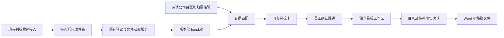

# 飞书判标与标书初稿联动

员工在飞书项目卡片查看预读结论、原文位置和待核实事项，选择跟进、暂缓或不投。确认跟进且证据核验通过后，可以生成标书初稿；目录和事实清单在群内以附件确认，完成的 Word 初稿发送到同一测试群。

本模块是易标的独立 Node 服务，复用现有招标文件预读服务；不会修改旧飞书平台的运行代码。默认关闭外部投递。没有模型配置时，不会把模板文本冒充 AI 生成结果。



## 启动

需要 Node.js >=22.13，推荐本机已验证的 Node 24。服务本身不增加 npm 依赖。编写 Worker 还需要 `client` 的 Electron 和原生依赖完成安装，参见 [本机搭建记录](../../docs/local-setup.md)。

```powershell
Set-Location E:\WorkSpaces\OpenBidKit_Yibiao\integrations\feishu
Copy-Item .env.example .env   # 仅首次；已有配置不要覆盖
npm.cmd test
npm.cmd start
```

默认监听 `127.0.0.1:4381`。`GET /health` 检查进程响应与实例所有权；失去租约后返回 503，由 [Windows 监管器](deployment/README.md) 停止旧实例再重启。`GET /ready` 检查本地接入配置、台账快照新鲜度和实例所有权，未就绪为 503；它不代替真实飞书/模型连通性验收。卡片可通过专用 CLI 机器人长连接接收，或由现有网关/TLS 反向代理转发到 `/lark/events`，同一应用只选一个接收通道。内部管理 API 不能直接公开。凭证和公司资料位于被 Git 忽略的 `.env`、`data/` 中。

## 必要配置

| 配置 | 用途 |
| --- | --- |
| `BID_API_KEY` | 至少 32 字符随机内部接入密钥；以 `Authorization: Bearer ...` 调用管理接口 |
| `BID_COMPANY_ID` | 已确认的唯一公司主体完整名称 |
| `BID_VAULT_DATABASE` | 现有 BidVault SQLite 数据库绝对路径，只读 |
| `BID_VAULT_FILES` | BidVault **data 根目录**，不是其 files 子目录；数据库相对路径自带 `files/` |
| `BID_VAULT_MAPPINGS` | 逐条核实的主体、更新时间、附件哈希映射 JSON 文件 |
| `BID_RULES_FILE` | 按 taskId/documentVersion/checksum 绑定的已核实结构化条款规则 |
| `PREREAD_BASE_URL` | 既有预读服务的内部 origin，仅允许内网/本机地址 |
| `PREREAD_HANDOFF_API_KEY` | 读取 handoff 的原始 key |
| `PREREAD_RELAY_AUTHORIZATION` | 接收标讯的**完整** `Bearer ...` 头，与 handoff key 分开 |
| `BID_SOURCE_CHAT_IDS` / `BID_SOURCE_SENDER_IDS` | 雷达来源群和发送者白名单，逗号分隔 |
| `LARK_APP_ID` / `LARK_APP_SECRET` | 飞书应用机器人身份 |
| `LARK_VERIFICATION_TOKEN` / `LARK_ENCRYPT_KEY` | 卡片事件验签与解密 |
| `BID_OPERATOR_IDS` | 可做判标和编写确认的员工 open_id 白名单 |
| `BID_CHAT_ID` / `BID_TEST_CHAT_IDS` | 唯一结果群，且必须包含于测试群白名单 |
| `BID_DELIVERY_MODE` | 默认 `disabled`；完成测试环境配置后设为 `test` |
| `MODEL_PROVIDER` | 易标模型 provider，OpenAI 兼容自定义接口可用 `custom` |
| `MODEL_PROVIDER_BASE_URL` / `MODEL_PROVIDER_API_KEY` / `MODEL_PROVIDER_MODEL` | 易标文本模型地址、凭证及模型名 |
| `BID_SUMMARY_HOUR` | 北京时间每日摘要小时，默认 18 |

`BID_DATA_ROOT` 可指定持久数据目录；`BID_ELECTRON_PATH` 可覆盖 Electron 可执行文件路径。密钥仅放本地配置或部署密钥管理，不要粘贴到群或提交 Git。

## 现有系统如何接入

标讯来源可用已授权用户的历史轮询，也可由既有网关将规范化事件转发到 `POST /radar`，认证使用 `BID_API_KEY`；两种入口按正文去重。专用机器人仅为本项目卡片建立独立长连接，保留旧应用消费者。HTTP 接收端先落库并返回 202，后台使用预读服务真实接口处理：

- `POST /openapi/preread/events/lark-message`，使用 relay authorization。
- `GET /api/preread/tasks/:taskId/handoff`，使用 handoff key。

事件字段：`eventType: "im.message.receive_v1"`、`eventId`、`messageId`、`chatId`、`senderId`、`messageType`、`content`；其他支持字段有 `chatType/createTime/senderType`。`content` 保留飞书原始消息 JSON 字符串。来源群和发送者均需命中白名单。鉴权后的重复消息不会重复排入本地收件箱。

已核对旧 standalone 部署中预读服务名为 `preread-api`，容器端口 3000；本目录提供 [本机访问覆盖文件](deployment/preread-host-access.compose.yml)，只绑定 `127.0.0.1:4382`。2026-09-10 已恢复既有 Docker 栈并应用覆盖文件，只重新创建预读 API，原 Compose 与其环境文件保持原样。旧 `STANDALONE_AUTHORIZATION` 对应本服务的 `PREREAD_RELAY_AUTHORIZATION`，旧 `FEISHU_*` 验签变量对应这里的 `LARK_*` 验签变量。应用覆盖文件时只使用旧部署的 `--env-file`；将本项目的来源群、来源机器人、投递群与测试群四个 `BID_*` 变量传入 Compose 调用进程，避免本项目空模型字段覆盖旧部署配置。

历史标讯轮询使用已授权用户的显式 CLI profile，每分钟读取来源群，持久保存分页窗口和游标。text/post 在预读接口边界展开；原始消息和接收结果保留在本地，补件 actionId 不会随进程重启丢失。机器人 profile 与来源读取的用户 profile 分开配置；open_id 必须使用对应应用下的值。

后台只跟踪真实回执中的 taskId，每分钟重读 handoff，以发现补件、预读完成或新版本。不假设上游存在任务列表 API。已有任务可用 `POST /watch` 注册 `{ "taskId": "..." }`。也可以 `POST /handoffs` 直接推入 `{ "handoff": {...}, "deadline": "2026-12-01T10:00:00+08:00", "reportUrl": "https://...", "sourceUrl": "https://..." }`。

待确认项目由测试群选择卡呈现，授权员工勾选后才请求预读。重点项目进入上游自动处理队列不代表预读已完成。来源消息变更时暂停旧批次、任务和卡片，保留人工核对状态。

只有可信且带时区的截止时间才能开启编写。未传入时，服务仅尝试读取预读中无需确认的明确“投标截止/递交截止”字段；歧义日期仍为待核实。预读完整性、文件缺失、扫描页、资格条款和红线等阻塞事项不能被“确认跟进”绕过。

## 原文件与生成

原文件通常由既有预读服务获取、OCR 和解析。本服务还可为真实缺件任务恢复已验证的贵州官方 XML-ZYZF 正文，分阶段上传并附加到原任务；详见 [正文恢复和 Windows 部署](deployment/README.md)。其他来源保留人工补件。本服务消费 handoff，编写阶段另需同一文件的字节。接入程序可将完整文件上传到内部接口：

```text
POST /sources?projectId=<项目卡返回的id>&name=tender.pdf
Authorization: Bearer <BID_API_KEY>
Content-Type: application/octet-stream

<原文件字节>
```

限制 30 MB，支持 PDF、Word、TXT、Markdown；上传 SHA-256 必须等于当前 handoff.snapshot.checksum。附件保存到 writing/sources，Worker 再次核验哈希、路径和快照。上传改变项目输入后需重新确认跟进。缺原文时保留待补状态；不能仅凭公告摘要编写整本标书。

每个公司/项目/文件版本使用独立 userData、数据库和工作目录；后台单并发，调用真实易标的导入、AI 目录、全局事实、正文和导出服务。阶段：

1. 准备项目并导入文件。
2. 发送建议章节清单；员工在群卡确认采用范围。
3. 发送完整目录；员工确认后生成正文。
4. 发送事实清单；缺失事实保持待补占位，由员工明确确认保留后继续。
5. 生成 Word 初稿并发到测试群。

确认按钮绑定实际快照与一次性阶段 challenge，清单附件成功送达前不开放继续。机器人固定 `globalFactsMode=placeholder`。初稿仍需公司人员复核，不自动报价、签章或投标提交。

## 台账和规则

原台账不含统一的公司归属/人工核实字段，不能把所有记录直接归给当前公司。映射示例见 [ownership-mappings.json](examples/ownership-mappings.json)，仅使用虚构数据。每一条需要 `recordId/companyId/verified/updatedAt/attachments`，每个附件需要 `id/sha256/verified`。记录发生变更、附件缺失、内容变化或证照到截止日失效后重新核实。

运行时刷新保留全部台账记录，但只读取归属映射唯一、公司与更新时间一致且已核实记录中的映射附件。跳过的附件显式标为未检查，记录保持待核实；可用候选附件仍每次核验真实 SHA-256。`readVaultSnapshot` 默认保留完整附件审计模式，后台 Worker 显式启用 `onlyMapped`，避免每分钟扫描全部历史附件导致超时。

规则文件示例见 [rules.json](examples/rules.json)。规则必须准确引用当前版本 handoff 的 requirementId；不把模型自由文本直接当作“已核实满足”。支持证照、业绩和明确人工核实三类。未覆盖的资格和红线自动进入待核实；找不到资料保持待核实，只有已核实不满足或已截止才建议不投。相同持证人不能用重复证照凑人数，相同合同不能用重复记录凑业绩项数。

## 运行、恢复与测试

SQLite WAL 持久保存项目、决策、回调去重、雷达收件箱、任务跟踪和投递队列。每日摘要按北京时间去重，服务需持续运行；电脑休眠/关机时不能接收或处理新消息。休眠导致实例租约失效时，服务会停止后续处理；重启服务后继续处理持久队列，运行中断的模型任务仍需人工核对并重试。生产应部署到常开主机，并与现有网关一起维护运行状态。

卡片尽量更新同一个消息。首次发送/文件发送使用稳定 UUID；响应不明且超过保守去重窗口的投递停止自动重发，避免群刷屏，由运维结合飞书消息记录核对。模型执行中断不会自动重复收费调用，卡片提供修复后重试入口。重试前应核查是否已有部分产物。

`npm test` 包含真实 SQLite、临时文件、签名回调、假预读和假飞书 HTTP 的全链路测试，以及已安装 Electron 时的真实隔离导入 smoke。假 HTTP/模型结果仅用于离线验证，不能算作真实群或真实 AI 验收。

正式启用前需完成已有预读服务恢复、雷达转发绑定、模型连通性、台账逐条归属核实、机器人入群及卡片回调配置，并在明确的测试群用一份真实完整招标文件验收。当前版本仅开放 disabled/test 投递模式；代码通过测试不表示生产已切流。
